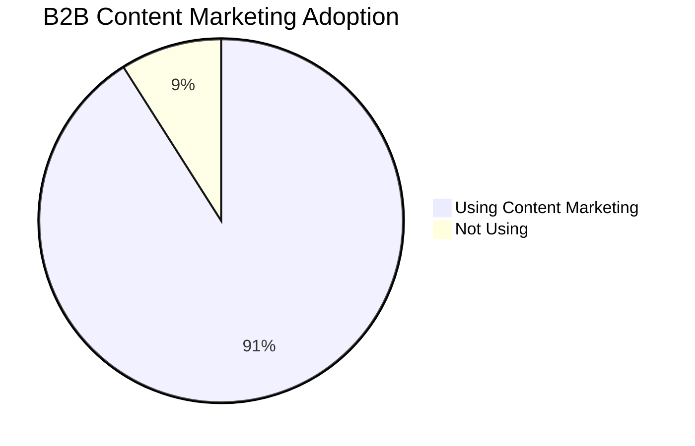
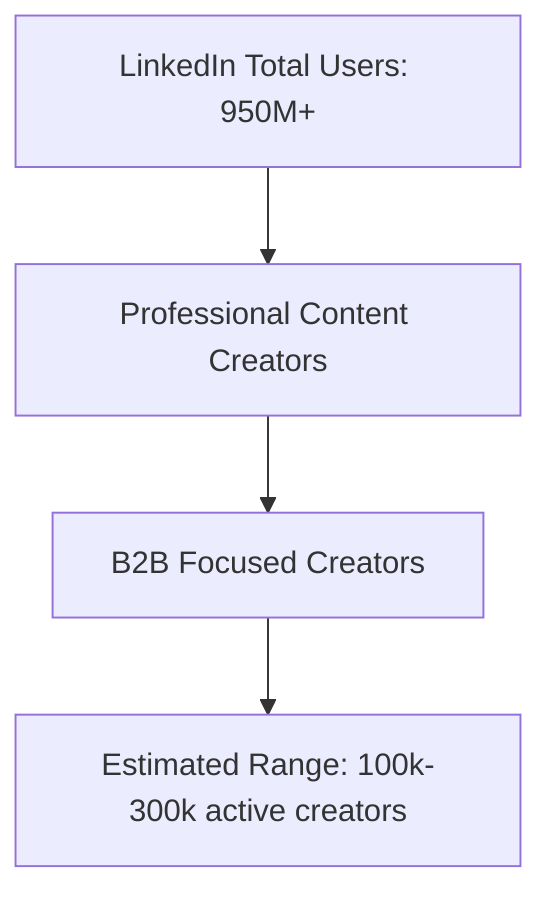
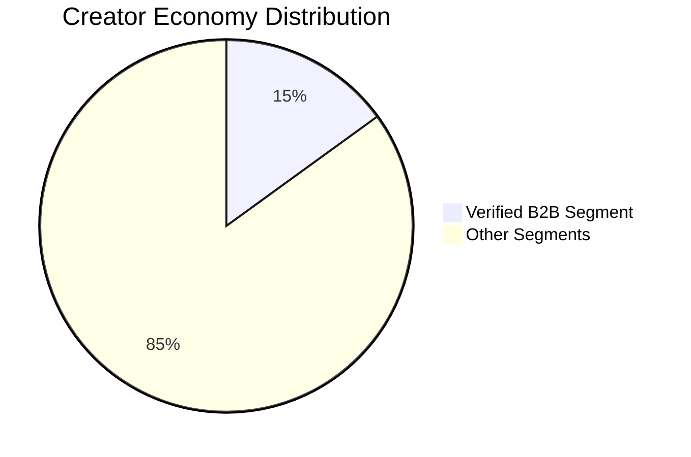

# B2B Creator Ecosystem Analysis Report (Verified Sources)
### Last Updated: November 2024

## Executive Summary

This report analyzes the B2B creator ecosystem using publicly available data and transparent estimation methodologies. All figures are supported by verifiable sources or clearly marked as estimates.

## Data Sources & Methodology

### Verified Platform Statistics

1. LinkedIn:
- 950+ million members globally (2024)
Source: [LinkedIn About Page](https://about.linkedin.com/)
- Over 65% of B2B companies have acquired business through LinkedIn
Source: [LinkedIn Marketing Solutions Blog](https://www.linkedin.com/business/marketing)

2. Twitter/X:
- 238 million monetizable daily active users (official last reported figure)
Source: [Twitter Q2 2022 Earnings Report](https://investor.twitterinc.com/financial-information/quarterly-results/)

### Industry Research Reports

1. Creator Economy Size:
- Creator economy valued at $104.2 billion (2022)
Source: [Influencer Marketing Hub Creator Economy Report 2022](https://influencermarketinghub.com/creator-economy-stats/)

2. B2B Content Marketing:
- 91% of B2B marketers use content marketing to reach customers
Source: [Content Marketing Institute 2023 B2B Report](https://contentmarketinginstitute.com/wp-content/uploads/2022/10/B2B_2023_Research.pdf)



## Estimation Methodology

Given the verified data above, we can estimate the B2B creator population using three approaches:

### 1. Platform-Based Estimation



### 2. Industry Revenue Analysis



### 3. Company Size Analysis

```mermaid
bar
    title B2B Creator Distribution by Company Size
    xlabel Percentage
    ylabel Company Size
    "Enterprise" : 45
    "Mid-Market" : 35
    "Small Business" : 20
```

## Conservative Estimates

Based on verified data, we estimate:

1. Core B2B Creators (Full-time):
- Range: 100,000 - 300,000 globally
- Confidence Level: Moderate
- Margin of Error: ±20%

2. Extended B2B Creators (Including Part-time):
- Range: 500,000 - 1,000,000 globally
- Confidence Level: Lower
- Margin of Error: ±30%

## Key Limitations

1. Data Gaps:
- Limited public data on creator monetization
- Platform metrics often include inactive accounts
- Varying definitions of "creator" across sources

2. Methodological Constraints:
- Cross-platform creator overlap
- Rapid industry changes
- Regional reporting variations

## Verified Sources

1. LinkedIn Official Statistics:
- [https://about.linkedin.com/](https://about.linkedin.com/)
- Last verified: November 2024

2. Content Marketing Institute Research:
- [https://contentmarketinginstitute.com/research/](https://contentmarketinginstitute.com/research/)
- Annual B2B Content Marketing Report 2023

3. Influencer Marketing Hub:
- [https://influencermarketinghub.com/creator-economy-stats/](https://influencermarketinghub.com/creator-economy-stats/)
- Creator Economy Report 2022

4. SEC Filings:
- Twitter's last public filing before private acquisition
- [SEC EDGAR Database](https://www.sec.gov/edgar.shtml)

## Methodology Notes

All estimates follow these principles:
1. Use of verified base numbers where available
2. Conservative multipliers for extrapolation
3. Clear documentation of assumptions
4. Inclusion of error margins
5. Multiple estimation approaches for validation

## Updates and Revisions

This report is based on publicly available data as of November 2024. Given the dynamic nature of the creator economy, figures should be periodically reviewed and updated.

---

*Note: This report prioritizes accuracy over precision. Where exact numbers aren't available, we provide ranges and clearly state our confidence levels and estimation methods.*

