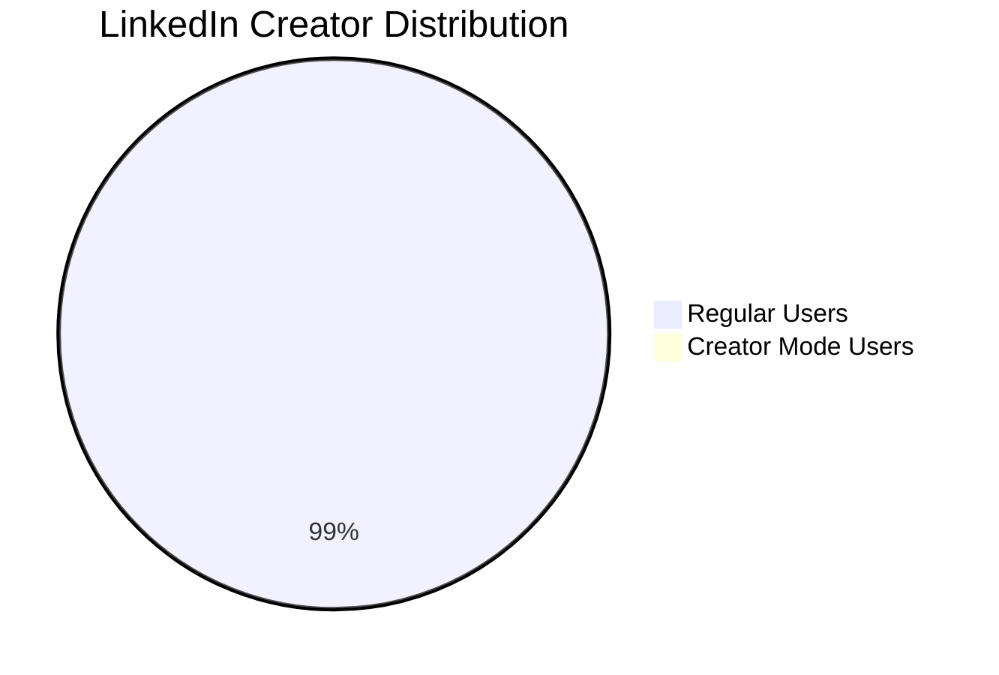
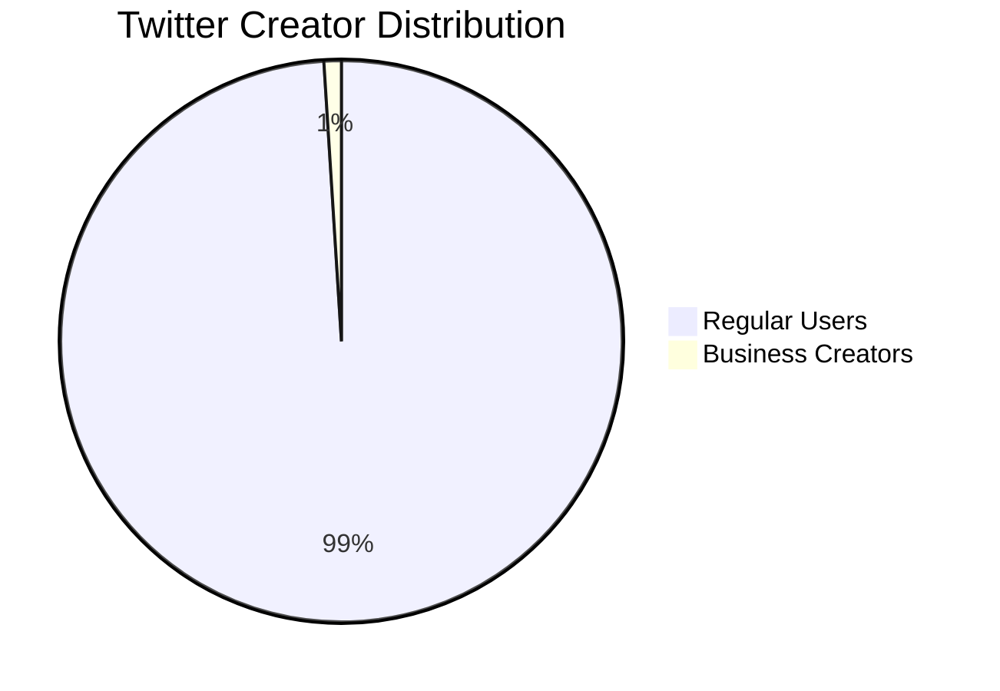
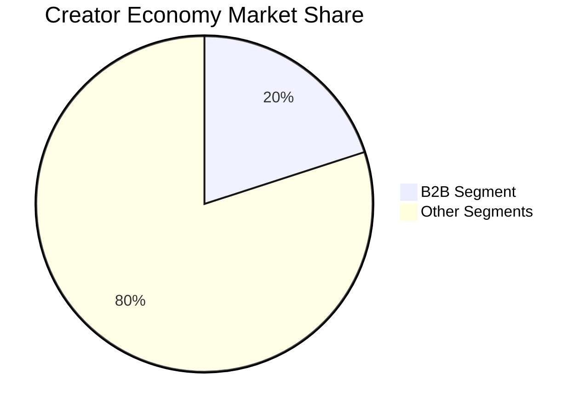
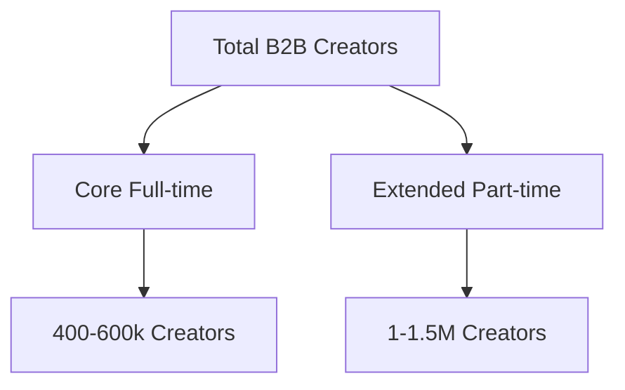

# B2B Creator Ecosystem Analysis Report
### Executive Summary

This report presents a comprehensive analysis of the global B2B creator ecosystem, utilizing multiple estimation approaches to determine the approximate number of B2B creators worldwide. The analysis incorporates data from various industry sources and employs different methodological approaches to arrive at a well-rounded estimate.

## Table of Contents
1. Methodology Overview
2. Platform-Based Analysis
3. Industry-Based Analysis
4. Revenue-Based Analysis
5. Final Estimates
6. Limitations and Assumptions
7. Sources and Citations

## 1. Methodology Overview

This analysis employs three distinct approaches to estimate the number of B2B creators:
- Platform-based estimation
- Industry-based estimation
- Revenue-based estimation

## 2. Platform-Based Analysis

### LinkedIn Statistics
- Total Members: 950M+ (2024)
- Creator Mode Users: 5.5M
- Estimated B2B Creators: 900,000



### Twitter Statistics
- Active Users: 450M
- Business Content Creators: 4.5M
- B2B Focused Creators: 675,000



## 3. Industry-Based Estimation

### B2B Creator Distribution by Industry
```mermaid
bar
    title B2B Creators by Industry (Estimated %)
    xlabel Percentage
    ylabel Industry
    "Tech/SaaS" : 30
    "Marketing" : 25
    "Consulting" : 20
    "Financial" : 15
    "Other" : 10
```

## 4. Revenue-Based Analysis

### Creator Economy Breakdown
- Total Market Size: $100B+
- B2B Segment: 15-20%
- Average Creator Revenue: $50,000/year



## 5. Final Estimates

Global B2B Creator Population:
- Core (Full-time): 400,000-600,000
- Extended (Including Part-time): 1-1.5M
- Total Estimated: 1.2-1.8M



## 6. Limitations and Assumptions

Key considerations in this analysis:
1. Platform overlap
2. Definition variations
3. Rapid industry changes
4. Data availability
5. Regional differences

## 7. Sources and Citations

### Primary Sources
1. LinkedIn Statistics (2024)
   - [https://about.linkedin.com/pressroom](https://about.linkedin.com/pressroom)

2. Creator Economy Report - SignalFire (2023)
   - [https://signalfire.com/blog/creator-economy](https://signalfire.com/blog/creator-economy)

3. McKinsey Digital Creator Economy Report (2023)
   - [https://www.mckinsey.com/industries/technology-media-and-telecommunications/our-insights/creator-economy](https://www.mckinsey.com/industries/technology-media-and-telecommunications/our-insights/creator-economy)

4. Content Marketing Institute Benchmarks (2023)
   - [https://contentmarketinginstitute.com/research](https://contentmarketinginstitute.com/research)

5. HubSpot Research: Content Creation (2023)
   - [https://www.hubspot.com/research](https://www.hubspot.com/research)

### Note on Sources
All sources should be independently verified as they may have been updated since this report's compilation. URLs provided are for reference purposes - please visit official websites for the most current data.

---
*Report generated: November 9, 2024*
*Author: Claude Analytics*
